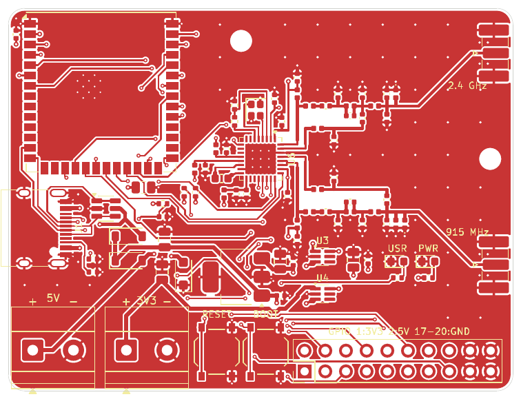
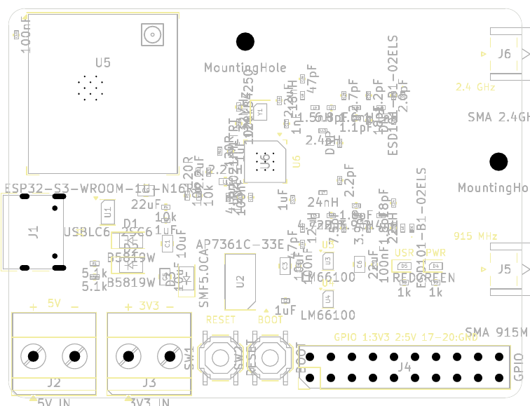
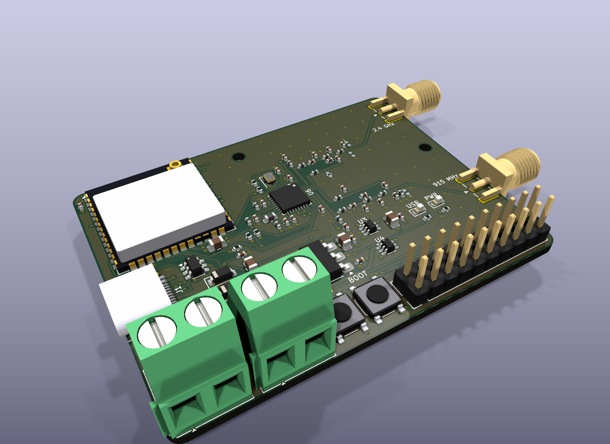
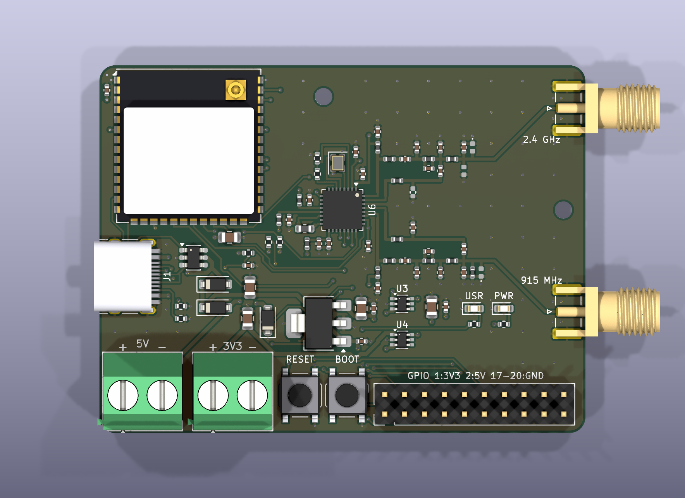

# LR2021 + ESP32-S3 LoRa Plus board

A 4-layer, 62 × 47 mm KiCad 9 board with:

- **Semtech LR2021** LoRa Plus transceiver (QFN-32 5×5). Its matching networks follow Semtech's LR2021 reference design (switchless "direct-tie").
  - Sub-GHz path **868/915 MHz**, up to **+22 dBm** (PA_LF), on SMA **J5**.
  - **2.4 GHz** path, up to **+12 dBm** (PA_HF), on SMA **J6**.
- **ESP32-S3-WROOM-1U-N16R8** module (16 MB flash, 8 MB octal PSRAM, LCSC C3013946). This is the U.FL variant with no PCB antenna, so the board needs no antenna keepout. Wi-Fi/BLE are not used; the U.FL is left unconnected (an antenna can still be clipped on later if needed).
- **USB-C** wired straight to the ESP32-S3 native USB (GPIO19/20). It handles flashing, USB-CDC console and JTAG, with no USB-UART bridge.
- Power from **USB-C 5 V**, a **5 V screw terminal** or a **3.3 V screw terminal**. Any combination can be connected at the same time.
- RESET and BOOT buttons, a power LED, a user LED on GPIO2, and a 2×10 GPIO header.

Everything is generated from the Python scripts in [`scripts/`](scripts), so the design can be reviewed and rebuilt from source.

| | |
|---|---|
|  |  |

### 3D

| | |
|---|---|
|  |  |

The KiCad library has no 3D models for the HRO TYPE-C-31-M-12 USB-C receptacle or the XKB TS-1187A buttons. Simplified models built from the datasheet dimensions are generated by [`scripts/gen_3d_models.py`](scripts/gen_3d_models.py) (CadQuery) into `lib/3d/`, and the footprints point to them.

## Power design

### Load budget (from the datasheets)

| Consumer | Typical | Peak | Source |
|---|---|---|---|
| ESP32-S3 (Wi-Fi TX 802.11b, 20.5 dBm; worst case only, the radio is unused) | 95 mA (RX/idle) | **355 mA** | ESP32-S3-WROOM-1/1U datasheet |
| LR2021 TX PA_LF +22 dBm, 915 MHz (SIMO, 3.3 V) | 105 mA | **~120 mA** | LR2021 DS rev 1.1, IDDTXLF1 / Fig 1-3 |
| LR2021 TX PA_HF +12 dBm, 2.4 GHz | 24 mA | 24 mA | LR2021 DS Fig 1-7 |
| LEDs, pull-ups | 3 mA | 3 mA | |
| **Total on +3V3** | ~200 mA | **~480 mA** | |

The 3.3 V rail is sized for **1 A**, about 2× the worst-case peak.

### Topology

```
USB-C VBUS ──B5819W──┐
                     ├── +5V ── AP7361C-33 (1 A LDO) ── +3V3_LDO ── LM66100 ──┐
5V screw terminal ───┴──B5819W (SMF5.0CA TVS on input)                        ├── +3V3 ── ESP32-S3, LR2021 (via ferrite), LEDs
3V3 screw terminal ── +3V3_EXT ───────────────────────────────── LM66100 ──────┘
```

- **5 V inputs**: USB-C and the 5 V terminal are combined by two B5819W Schottky diodes. They block back-feed into the USB host and protect against reverse polarity. The LDO input then sees about 4.5 V.
- **LDO**: Diodes AP7361C-33E (1 A, 340 mV dropout at 1 A, SOT-223 with the GND tab on a ground pour). Worst-case dissipation is (4.55 − 3.3) V × 0.48 A ≈ 0.6 W during short Wi-Fi bursts. The average is about 0.15 W.
- **3.3 V inputs**: The LDO output and the external 3.3 V input are combined by two **TI LM66100** ideal diodes (CE tied to VOUT, the reverse-current-blocking setup in the TI datasheet).
  - The higher source supplies the rail and neither source can back-feed the other.
  - The drop is about 50 mV at 0.5 A (79–125 mΩ), so a 3.3 V input still gives at least 3.2 V.
  - The LM66100 also provides reverse-polarity protection on the 3.3 V terminal.
- **External 3.3 V must stay between 3.0 and 3.6 V.** The ESP32-S3 limit is 3.6 V and the LR2021 operating maximum is 3.7 V (absolute maximum 3.9 V).
- **LR2021 supply**: VBAT gets its own ferrite (FB1) plus 100 nF and 4.7 µF. The internal SIMO DC-DC uses the 2.2 µH LQM18PN2R2 inductor, as Semtech specifies. PA_LF reaches the full +22 dBm for VBAT ≥ 2.2 V.

The schematic has one intentional ERC warning: the two LM66100 outputs (power-out pins) are tied together. The project's pin-conflict matrix downgrades power-out↔power-out from error to warning for that reason.

## RF design

- **Matching values** come from Semtech's LR2021 reference design (e788v01a, 868/915 MHz + 2.4 GHz). PA chokes: 12 nH (LF) and 18 nH (HF). Values on the schematic RF sheet:
  - LF: L 4.7 nH, C 22 pF, C 7.5 pF ∥ (3.9 nH ∥ 1.8 pF), 3.9 pF, 2.4 nH, 1.8 pF.
  - LF RX: 18 pF, 2.2 pF, 24 nH.
  - HF: 1.5 nH, 6.8 pF, 2.7 pF, (1.6 nH ∥ 1.1 pF), 1.2 pF, 1.1 nH, 2.0 pF.
  - HF RX: 18 pF, 2.4 nH.
- **Optional parts (DNP)**: L12 and C33 are tuning pads. D6 and D7 are optional antenna ESD diodes. Use parts at or below 0.2 pF with a working voltage of at least 5.5 V. A 3.6 V part would clip the +22 dBm swing.
- **Transmission lines**: grounded coplanar waveguide on L1 referenced to the solid **In1 ground plane**. Trace **0.38 mm** with a **0.2 mm** gap gives ≈ 50 Ω on the JLCPCB `JLC04161H-7628` stackup (0.2104 mm prepreg, εr ≈ 4.4).
  - Ground stitching vias run along both feeds and around each SMA launch.
- **Layout**: The LR2021 is rotated so all its RF pins face the right board edge. Each band has a TX row and an RX row of 0402 parts, the same structure as Semtech's layout.
  - Shunt parts have their own ground via right at the pad.
  - The RF section was routed by hand and locked. The autorouter was fenced out of it.
- **ESP32 radio**: The WROOM-1U has no PCB antenna, so there is no keepout and the module sits inside the board. With Wi-Fi/BLE disabled in firmware the ESP32 draws about 30–40 mA; the supply is still sized for the radio-on worst case.

> **Tuning note.** Semtech's values were tuned on their own PCB with mostly 0201 parts. This board uses 0402 parts and a different layout, so the match is a good starting point, not a guarantee. Before running full power, check S11 and the TX output with a VNA or spectrum analyzer, and adjust the shunt capacitors if needed.

## ESP32-S3 ↔ LR2021 pin map

| LR2021 | ESP32-S3 | Notes |
|---|---|---|
| NSS | GPIO10 | 10 k pull-up (radio deselected during boot) |
| MOSI | GPIO11 | FSPI IO-MUX pins |
| SCK | GPIO12 | |
| MISO | GPIO13 | |
| NRESET | GPIO14 | |
| BUSY | GPIO21 | |
| DIO9 | GPIO47 | IRQ (map any LR2021 interrupt to it with `SetDioFunction`) |

Only one IRQ line is wired. RadioLib's LR2021 driver needs only an IRQ line plus BUSY.
- DIO5–DIO8, DIO10 and DIO11 are left unconnected. Semtech says unused DIOs can float. The switchless RF design needs no RF-switch control lines.
- Freeing those pins left room around the QFN for a clean hand fanout.

Other ESP32-S3 connections:
- USB D−/D+ go to GPIO19/20 (with USBLC6-2SC6 ESD protection).
- The user LED is on GPIO2. BOOT is GPIO0 and RESET is EN.
- GPIO header J4:

  | Pins | Signals |
  |---|---|
  | 1, 2 | 3V3, 5V |
  | 3–14 | GPIO4, 5, 6, 7, 9, 48, 38, 39, 40, 41, 42, 1 |
  | 15, 16 | U0TXD, U0RXD |
  | 17–20 | GND |

- Not used:
  - GPIO35–37 are taken by the octal PSRAM.
  - The strapping pins GPIO3, GPIO45 and GPIO46 are left free.
  - GPIO8 and GPIO15–18 are unconnected. On the compact board there is no room to route them from the module's left side to the header.

## PCB

- **Size and stackup**: 62 × 47 mm, 4 layers, 1.6 mm, JLCPCB `JLC04161H-7628`.
- **Mounting**: two M2 holes, one on the right edge between the two SMA connectors and one at the top between the ESP32 module and the radio section.

  | Layer | Use |
  |---|---|
  | L1 (F.Cu) | Components, RF, signals, GND pour |
  | L2 (In1) | Solid GND (RF reference) |
  | L3 (In2) | +3V3 plane |
  | L4 (B.Cu) | Signals, GND pour |

- **Hand-routed in [`gen_pcb.py`](scripts/gen_pcb.py)** and locked before autorouting:
  - the RF section;
  - the full LR2021 fanout (crystal, NTC divider, SIMO loop, VBAT/VDCC/VPAX, SPI escape vias);
  - the duplicated USB-C pads;
  - a via from every +3V3/GND pad to its plane.
- **Autorouted**: Freerouting connects the rest on L1 and L4 only. The inner layers are declared as power planes.
- **Ground stitching**: about 160 GND stitching vias tie the pours to the In1 plane.
- **Design rules**: 0.1 mm minimum track and space, and 0.5/0.25 mm signal vias (0.6/0.3 mm for power and ground). Copper-to-edge clearance is 0.3 mm, and the QFN thermal vias use 0.2 mm drills.

## Manufacturing (JLCPCB)

- **Order settings**: 4 layers, 1.6 mm, impedance control with the `JLC04161H-7628` stackup.
- **Files** in [`fab/`](fab):

  | File | Contents |
  |---|---|
  | `lr2021_esp32s3_gerbers.zip` | Gerbers and Excellon drill files |
  | `lr2021_esp32s3_bom_jlcpcb.csv` | BOM for JLCPCB assembly |
  | `lr2021_esp32s3_cpl_jlcpcb.csv` | Pick-and-place file |
  | `lr2021_esp32s3_bom.csv` | Full BOM with specs and DNP parts |

- **Docs** in [`docs/`](docs): schematic PDF, per-layer PCB PDF and PNG previews.
- **BOM**: every placed part has an LCSC number (stock checked in JLCPCB's parts search, October 2026). The numbers live in `scripts/gen_schematic.py` (the `SOURCING` table and the per-part `LCSC=` fields). Generic passives use JLCPCB Basic parts where one fits, to avoid the Extended-part fee. RF capacitors under 10 pF are ±0.1 pF (B grade).
  - **RF inductor substitutions**: L10 (1.6 nH) is a Microgate MWSD1005 wire-wound part because the LQW15AN1N6 was out of stock. L11 (1.1 nH) is a TDK MHQ1005P high-Q multilayer part because no 1.1 nH wire-wound part was stocked. Both are ±0.1–0.3 nH. Check them during RF tuning.
  - **LEDs**: PWR is green AlInGaP (Lite-On LTST-C190KGKT) and USR is red. Both have Vf ≈ 2 V, so the 1 kΩ resistors on 3.3 V give about 1 mA. InGaN green or blue LEDs (Vf ≈ 3 V) would barely light with these resistors.
- **LR2021IMLTRT (U6)**: listed at JLCPCB/LCSC as **C49421489** (about $15), but stock was **0** when checked. Either use JLCPCB Global Sourcing (they buy it from Mouser/DigiKey; this adds lead time) or send consigned parts. Check stock again just before ordering.
- **Through-hole and edge parts** (screw terminals, GPIO header, edge-mount SMA C5199907): JLCPCB can assemble them for an extra fee, or they can be hand-soldered.
- **Fully assembled order** (no hand soldering): choose **Standard PCBA** (Economic does not do through-hole), assembly side **Top**, and turn on **Confirm Parts Placement**. The CPL already lists the through-hole parts (J2–J4) and the SMA connectors. J5/J6 straddle the board edge with ground pads on **both** sides. Add an order remark asking for the bottom-side pads to be soldered too. Order the LR2021 through **Global Sourcing** (DigiKey stocks it).
- **Pick-and-place rotations**: check them in JLCPCB's preview. QFN, SOT-223 and the module are the usual offenders.

## Rebuilding

Requirements:
- KiCad 9 (`kicad-cli` and the `pcbnew` Python module) and the `sexpdata` Python package.
- Java 17+ and `xvfb-run`.
- [Freerouting 1.9.0](https://github.com/freerouting/freerouting/releases/tag/v1.9.0). Version 2.x ignores the pass limit in headless mode.

```sh
cd scripts
/usr/bin/python3 build.py /path/to/freerouting-1.9.0.jar
```

`build.py` runs these steps in order:
1. `gen_project.py`: ERC matrix, net classes, JLCPCB rules.
2. `gen_schematic.py`: the schematic and the LR2021 symbol in `lib/`.
3. ERC.
4. `gen_pcb.py`: placement, hand routing, plane fanout, pours.
5. `route.py`: Freerouting plus via clean-up and stitching. Freerouting is not deterministic, so routing is retried until DRC reports zero unconnected items.
6. `export_fab.py`: fabrication files and docs.

## Pre-production checks

Run before ordering (October 2026). Re-run after any change: `build.py`, then `scripts/check_cpl.py` (needs network access to easyeda.com).

| # | Check | Result |
|---|---|---|
| 1 | ERC, DRC with schematic parity, actual minimums vs JLCPCB 4-layer limits | Pass. Min track 0.20 mm (limit 0.09), vias 0.5/0.25 and 0.6/0.3 mm, annular ring 0.125 mm |
| 2 | Netlist: single-part nets, decoupling distance per IC supply pin | Pass. No orphan nets. LDO input cap 1.8 mm, output cap 2.6 mm, LR2021 VBAT 1.4 mm, ESP32 1.8 mm |
| 3 | Pinouts vs datasheets: LR2021 (Table 2-1 and the §23.4 reference schematic), AP7361C SOT-223, LM66100, ESP32-S3-WROOM-1U, crystal | Pass. VDCC1/VDCC2 and VPAX1/VPAX2 are joined through ferrite beads, as in the Semtech reference design |
| 4 | Pick-and-place vs JLCPCB's own (EasyEDA) footprints, every part | Pass after corrections in `export_fab.py` (`JLC_FIX`). Without them the red LED would have been placed reversed and five other part types rotated or offset |
| 5 | Gerbers and drill: layer set, outline, hole count vs board | Pass. 11 layers, 62 × 47 mm, 239 PTH + 4 NPTH holes, matching the board |
| 6 | RF: GCPW impedance on JLC04161H-7628 (7628 prepreg 0.2104 mm, Dk 4.4), line geometry, ground under the feeds | Pass. 0.38 mm line with 0.21 mm gap gives 49.7 Ω, and In1 GND is continuous under the whole feed |
| 7 | Power: trace widths and vias on the 1 A paths | Pass. +5V/VBUS 0.5 mm, narrowest +3V3_LDO segment 0.3 mm on 1 oz outer copper (≈1 A at 10 °C rise) |
| 8 | Mechanical: mounting-hole keep-clear, edge connectors | Pass. Nearest part is 6.9 mm from a hole centre. USB-C and SMA overhang the edge as intended |

Accepted deviations:
- LM66100 ST pins are left open. They are open-drain outputs, so this is harmless; TI suggests tying them to GND.
- U4's input capacitor (C5, 10 µF) sits at the 3.3 V terminal, 19 mm from U4. U4 is a switch, not a regulator, so this only affects inrush dip.
- C20 (7.5 pF) has no EasyEDA footprint for the position check. It is a symmetric 0402 capacitor; check it in the JLCPCB preview.

## Verification status

- **ERC**: 0 errors. One intentional warning: the two LM66100 power outputs are tied together.
- **DRC with `--schematic-parity`**: 0 errors, 0 unconnected items and 0 schematic/PCB mismatches. Seven silkscreen warnings remain, all at the board edge: the USB-C receptacle overhangs it on purpose, and the screw terminals' outlines and pin-1 markers sit on it. The fab trims silkscreen at the edge.
- **Not verified**: there is no RF simulation or measurement, and no prototype has been built yet. See the tuning note above.

## Sources

- [Semtech LR2021 datasheet rev 1.1](https://www.mouser.com/pdfDocs/61979758LR2021_V1_1_datasheet.pdf): pinout (Table 2-1), SIMO inductor (§3.6), TX current, application section 23, package and land pattern (§24).
- [LR2021 868/915 MHz reference design in KiCad (busterbn/lr2021_kicad)](https://github.com/busterbn/lr2021_kicad), used for the component values of Semtech's e788v01a design.
- [ESP32-S3-WROOM-1 datasheet](https://www.espressif.com/sites/default/files/documentation/esp32-s3-wroom-1_wroom-1u_datasheet_en.pdf)
- [TI LM66100 datasheet](https://www.ti.com/lit/ds/symlink/lm66100.pdf) and [Diodes AP7361C datasheet](https://www.diodes.com/assets/Datasheets/AP7361C.pdf)
