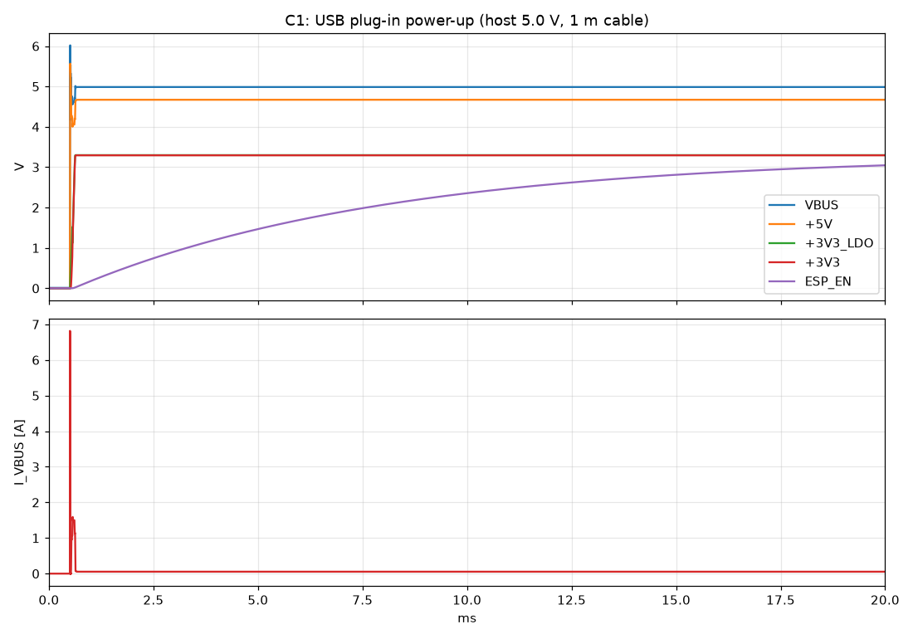
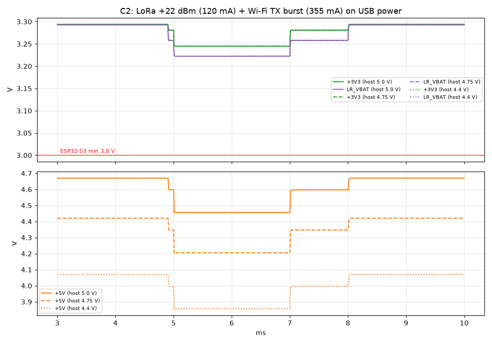
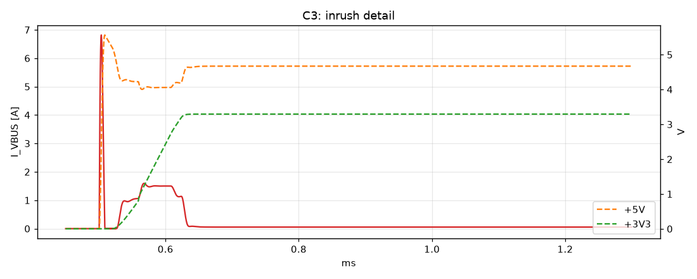
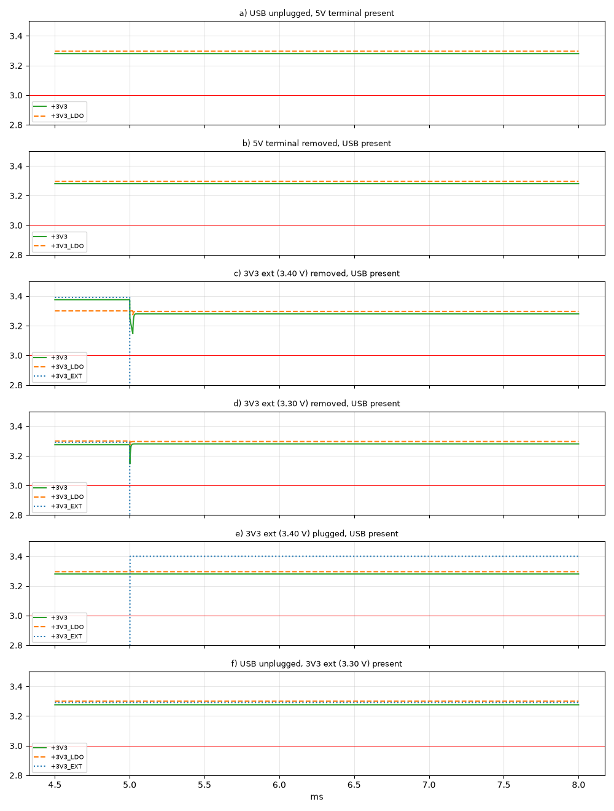
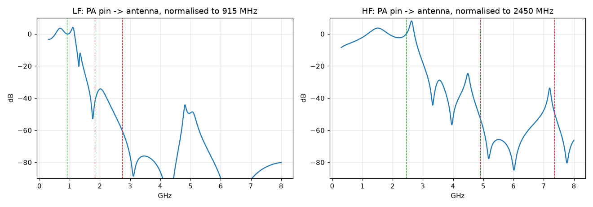

# Design review, round 4 (pre-production)

Full review of the board before ordering. Earlier rounds (checks 1–15) are summarised in the [README](../README.md#pre-production-checks). The scripts behind every number here are in [`analysis/`](../analysis), and the plots are in [`review/`](review).

## Result

The board is ready for production. This round found four things:

| # | Finding | Severity | Action |
|---|---|---|---|
| 1 | Antenna ESD diodes D6/D7 were DNP. Semtech's reference design populates them, and AN1200.107 recommends ESD protection on the antenna ports. | Medium | **Fixed.** Populated with DOWO PESD0402V12 (C19626255): 0.05 pF, bidirectional, Vrwm 12 V. Simulated detuning is −0.04 dB at 915 MHz and −0.05 dB at 2.45 GHz. |
| 2 | USB plug-in charge is 155 µC, against the USB-IF guideline of 50 µC. The LDO charges ~37 µF effective on 3.3 V at its 1.5 A limit for ~80 µs. | Low (compliance only) | Accepted. Most ESP32 boards behave the same way; it only matters for formal USB certification. |
| 3 | Unplugging the external 3.3 V while the board runs from it dips +3V3 to 3.15 V (worst-case tolerances: ~3.0 V) until the LDO path takes over (LM66100 turn-on at −150 mV). | Low | Accepted. Don't hot-unplug the 3V3 terminal while running. |
| 4 | Only ~1 GND via per 5–6 mm next to the 50 Ω antenna feeds (λ/20 at 2.45 GHz is 3.4 mm). | Medium | **Fixed.** Added a post-route via fence (`scripts/add_rf_fence.py`, now part of `build.py`): 32 vias, largest gap 1.0–2.4 mm on the long runs. |

After the fixes, ERC shows only the one intentional warning. DRC with parity shows 0 errors, 0 unconnected and 0 mismatches. All 78 placed parts land on JLCPCB's own footprints. The drill file has 271 PTH holes (239 before the fence + 32) and 4 NPTH.

## A. Freshness
- **A1:** Gerbers, drill, BOM and CPL regenerated from the current board are identical in content to the committed files. Only timestamps differed.
- **A2:** ERC, DRC with schematic parity, and the CPL check against EasyEDA footprints all pass.
- **A3:** Live JLCPCB stock was checked for all BOM lines. Everything is in stock with a wide margin except the LR2021 (ordered through Global Sourcing). The tightest are the 1.1 pF capacitor (740 in stock, 5 needed) and the SMA (903, 10 needed).

## B. Netlist
- **B1:** The RF networks were built as graphs (nets + components with type and value) from our board and from a KiCad port of Semtech's reference design (e788v01a). The graphs are **isomorphic**: all 31 components sit between the same nets with the same values, including the NC positions. The only difference was D3/D4, the antenna ESD diodes that the reference populates (finding 1). After the fix, our D6/D7 map onto them, and the diodes differ only in part number.
- **B2:**
  - **ESP32 EN:** 10 k / 1 µF, as Espressif recommends.
  - **ESP32 straps:** GPIO0 has a 10 k pull-up and the BOOT button. GPIO45 is free (internal pull-down gives a 3.3 V flash, correct for N16R8). GPIO46 and GPIO3 are free.
  - **USB-C:** 5.1 k on CC1 and CC2. D−/D+ go to GPIO19/20.
  - **LR2021:** NSS has a 10 k pull-up. NRESET is driven directly, as in the reference design. The crystal needs CL = 10 pF (9.5–10.5), and the part is NDK 10 pF.
  - **Crystal strays:** XTA ≈0.5 pF and XTB ≈0.9 pF (allowed 0.2–3 pF). XTA–XTB coupling is ≪0.3 pF (1.2 mm parallel run, 0.3 mm gap).
- **B3:**
  - **Capacitors:** every capacitor has ≥×1.8 voltage margin over its net. RF capacitors are 50 V C0G, sized against an ~8 V peak PA swing.
  - **SIMO inductor L1:** 750 mA, 0.3 Ω, SRF 70 MHz. This meets AN1200.107's ≤0.5 Ω, ≥200 mA and ≥20 MHz.
  - **Ferrites and chokes:** FB1/FB3 are rated 550 mA (≤140 mA used). PA chokes are rated 500 mA (LF, ≤120 mA used) and 370 mA (HF, ≤25 mA used).

## C. SPICE (ngspice, `analysis/pwr.py`)
The model covers:
- **USB host and cable:** 1 m, 0.2 Ω, 1 µH.
- **Diodes:** B5819W fit.
- **AP7361C:** soft-start 120 µs, loop around 200 kHz, current limit 1.5 A, fold-back 0.4 A, 0.36 Ω dropout.
- **LM66100:** ideal diode with the datasheet thresholds (on at −150 mV, off at +35 mV, 95 mΩ).
- **MLCCs:** DC-bias derated. For example, 22 µF 0805 at 3.3 V is taken as 12 µF.

| Test | Result |
|---|---|
| C1 USB plug-in | +3V3 is stable 0.12 ms after plug-in. EN crosses 0.75·VDD 10.4 ms later (ESP32 needs ≥50 µs). No overshoot. See  |
| C2 LoRa +22 dBm (120 mA) + Wi-Fi burst (355 mA) | +3V3 minimum 3.245 V and LR_VBAT 3.222 V, the same for a 5.0, 4.75 or 4.40 V host. The LDO stays in regulation.  |
| C3 inrush | 6.8 A for a few µs (cable LC), then 1.5 A for ~80 µs. 155 µC in total (finding 2). Peak +5V is 5.56 V, under the AP7361C's 6.5 V absolute max.  |
| C4 source switchover | USB ↔ 5 V terminal and plugging in external 3.3 V cause no dip. Unplugging external 3.3 V dips to 3.15 V (finding 3).  |

## D. RF (`analysis/rfsim.py`, nodal model built from the netlist)
The component models include C0G ESR/ESL and wire-wound L with Q and SRF. The PA is modelled as an ideal voltage node, the LNA in TX as 0.5 pF and the antenna as 50 Ω.

| | 915 MHz | 2.45 GHz |
|---|---|---|
| Load seen by the PA | 17.8 + j15.4 Ω | 6.4 − j10.7 Ω |
| 2nd / 3rd harmonic suppression | −43 / −61 dB | −53 / −49 dB |
| Band flatness | 863–928 MHz within 0.6 dB (one BOM covers 868 and 915) | 2400–2483 MHz within ±1 dB |
| Feed loss (estimate) | 21 mm, ~0.18 dB | 20 mm, ~0.33 dB |

The GCPW is 0.38 mm wide with 0.2 mm gaps, giving 49.7 Ω on JLC04161H-7628. In1 GND is continuous under every RF pad and line. Finding 4 is the via fence.

## E. Thermal and current
- **E1, junction temperatures:**
  - **LDO, worst case** (Wi-Fi + LoRa TX, 5.25 V in): 0.74 W, a 44–81 °C rise depending on the copper. That is ≤106 °C at 25 °C ambient.
  - **LDO, LoRa TX only:** 0.27 W, a 16–30 °C rise.
  - **Schottky diodes:** ≤0.2 W. **LM66100:** 22 mW.
- **E2, current capacity:** every power track has ≥×2 margin (IPC-2221, 10 °C). Examples: +5V/VBUS 0.5 mm carries 1.45 A against 0.5 A needed, and the narrowest +3V3 segment (0.3 mm) carries 1.0 A against 0.5 A. Each via carries ≤0.5 A against ~1 A capacity.

## F. Assembly and mechanics
- **F1:** The smallest pad gap between different parts is 0.43 mm (none below 0.3 mm).
- **Enclosure:** fits the final board. D6/D7 are 0402 parts in the RF area, far below the lid.

## G. Bring-up checklist
1. **Visual check:** U6 pin 1, D4/D5 polarity, U1/U3/U4 orientation, and solder bridges on the QFN and module pads.
2. **Before power:** resistance from +5V, +3V3 and VBUS to GND should be ≫100 Ω.
3. **First power from a bench supply** on the 5 V terminal, current limit 150 mA:
   - expect ~50–70 mA;
   - +3V3_LDO = 3.30 V ±2 %;
   - the PWR LED lights.
4. **USB:** the ESP32 enumerates as USB-Serial/JTAG (VID 303A). Flash `firmware/pinmap_check`: the LED blinks and the serial output shows 8 MB PSRAM.
5. **LR2021:**
   - after reset, BUSY goes low;
   - SPI GetVersion responds;
   - VDCC ≈1.55 V on C14.
6. **RF, conducted test** into an attenuator with an SDR or spectrum analyser:
   - start at 0 dBm and trim the crystal with SetXoscCpTrim;
   - step up to +22 dBm at 915 MHz (current ~105–120 mA), then +12 dBm at 2.45 GHz;
   - check the harmonics.
7. **PA tables and OCP:** measure on this board as AN1200.107 recommends. Set OCP to the measured worst-case current +25 % (defaults: 150 mA LF, 50 mA HF).
8. **Thermal:** check the LDO temperature during a continuous TX test.
