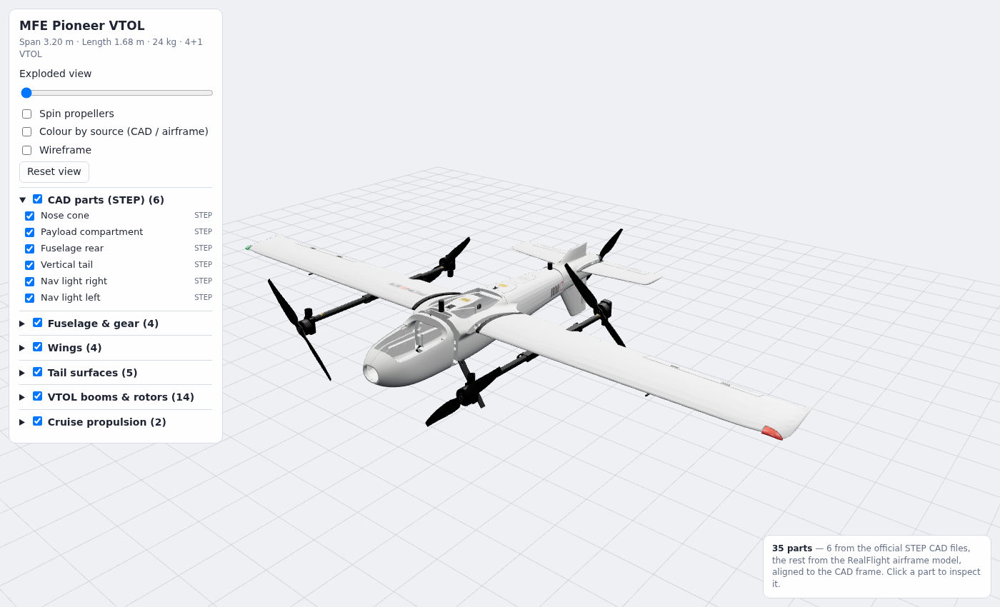
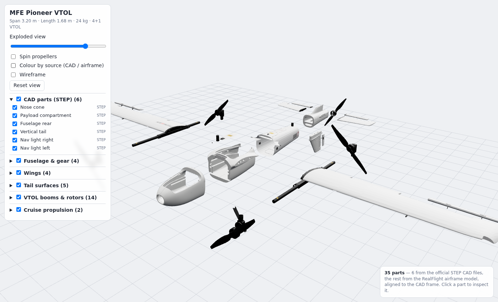

# MFE Pioneer VTOL – full 3D model

Assembled 3D model of the [makeflyeasy Pioneer](https://github.com/makeflyeasy/MFE_ArduPlane/tree/main/Pioneer)
VTOL (3.20 m span, 1.68 m length, quad + pusher).




Open `index.html` over HTTP (e.g. `python3 -m http.server`, then `/pioneer/`) for an interactive viewer:
orbit/zoom, per-part visibility, exploded view, spinning props, colour-by-source, click-to-inspect with dimensions.

## Files

| File | What |
|---|---|
| `pioneer_full.glb` | Complete aircraft, 35 named parts, metres, glTF Y-up, nose toward −Z |
| `parts/pioneer_*.stl` | The 5 official CAD parts meshed from STEP, in mm, original CAD coordinates |
| `tools/` | Scripts that rebuild everything from the upstream repo |

## Where the parts come from

The upstream folder has only **5 true 3D CAD parts** (STEP). All five share one aircraft coordinate frame:

| Part | Upstream file |
|---|---|
| Nose cone | `开拓者机头（Pioneer head）.step` |
| Payload compartment | `开拓者载荷舱（Pioneer payload compartment）.step` |
| Fuselage rear | `开拓者机身尾部（Pioneer fuselage rear）.step` |
| Vertical tail | `开拓者垂尾（Pioneer tail）.step` |
| Nav light housing (×2, left one mirrored) | `开拓者航灯外壳（Pioneer navigation light housing）.stp` |

The wings, ailerons, horizontal stabilizers, elevators, rudder, VTOL booms, rotor motors and props, pusher prop,
landing gear, mid-fuselage and top hatch are **not** published as CAD. They come from the RealFlight SITL model
(`SITL_Models_RealFlight/CAD/Pioneer.fbx` + `Pioneer.tga` texture). That model was registered onto the STEP parts
with scaled ICP (RMS error ≈16 mm) and rescaled to real size. The result is 3.17 m span, which matches the 3.20 m spec.
Treat these parts as visual approximations, not manufacturing geometry.

Not included, because upstream publishes them only as 2D drawings (DWG/PDF/PNG): wooden boards, the cruise-motor
carbon plate, the cruise ESC plate, and the cruise and rotor motor mounts.

The nav light STEP sits about 10 cm ahead of the wing-tip socket of the airframe model, so it is snapped to that socket.

## Rebuild

```sh
pip install cadquery-ocp trimesh scipy rtree shapely pillow
npx fbx2gltf -b -i Pioneer.fbx -o pioneer_fbx      # FBX -> GLB (Pioneer.tga next to it)
python3 tools/conv.py "<part>.step" stl/<name>.stl  # for head, payload, rear, tail, navlight
python3 tools/align.py                              # ICP: STEP frame -> FBX frame, writes M.npy
python3 tools/build.py                              # writes pioneer_full.glb
```
